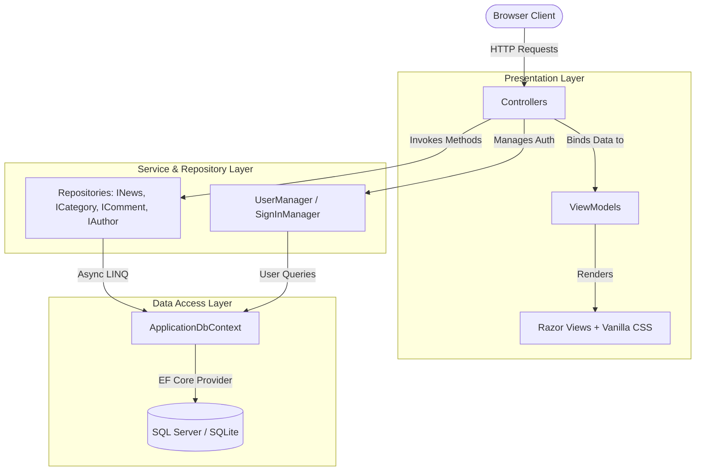
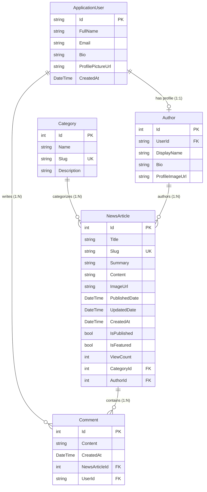

# NewsSphere — Comprehensive Architectural & Technical Documentation

> **A Production-Ready News Web Application built with C#, ASP.NET Core MVC, Entity Framework Core, ASP.NET Core Identity, and the Repository Pattern.**

---

## Table of Contents
1. [Project Overview & Objectives](#1-project-overview--objectives)
2. [Technology Stack & Dependencies](#2-technology-stack--dependencies)
3. [Architectural Pattern & Principles](#3-architectural-pattern--principles)
4. [Project Directory & File Structure](#4-project-directory--file-structure)
5. [Database Schema & Domain Models (ER Design)](#5-database-schema--domain-models-er-design)
6. [Repository Pattern & Data Access Layer](#6-repository-pattern--data-access-layer)
7. [Dependency Injection & Middleware Pipeline](#7-dependency-injection--middleware-pipeline)
8. [Identity, Authentication & Role-Based Authorization](#8-identity-authentication--role-based-authorization)
9. [SEO URL Slugs & Custom Routing Engine](#9-seo-url-slugs--custom-routing-engine)
10. [Core Features & Application Workflows](#10-core-features--application-workflows)
11. [Frontend Architecture & Pure Vanilla CSS Design System](#11-frontend-architecture--pure-vanilla-css-design-system)
12. [Database Seeding & Pre-configured Test Accounts](#12-database-seeding--pre-configured-test-accounts)
13. [Controller & Endpoint Reference Matrix](#13-controller--endpoint-reference-matrix)
14. [Setup, Migrations & Deployment Instructions](#14-setup-migrations--deployment-instructions)
15. [Troubleshooting & Common Pitfalls](#15-troubleshooting--common-pitfalls)

---

## 1. Project Overview & Objectives

**NewsSphere** is a complete, enterprise-grade news web application engineered using modern ASP.NET Core MVC and C#. The application bridges real-world newsroom editorial workflows with high-performance reader experiences.

### Key Objectives:
- **Clean Architecture & Separation of Concerns:** Rigid isolation between Domain Entities, ViewModels, Repositories, Business Logic, and Razor Views.
- **Pure Native Frontend:** Zero reliance on Bootstrap, Tailwind CSS, Material UI, React, Angular, Vue, or jQuery. Built exclusively with **semantic HTML5, Razor Tag Helpers, and a custom Vanilla CSS design system (`site.css`)**.
- **Role-Based Security:** Granular access control separating **Readers** (public browsing, searching, commenting), **Authors** (authoring and managing their own articles), and **Administrators** (full platform control, category creation, comment moderation, user directory).
- **SEO & Discoverability:** Human-readable slug-based URLs for articles (`/news/details/article-headline`) and categories (`/news/category/technology`).
- **Data Integrity & Performance:** Asynchronous queries via EF Core, `AsNoTracking()` for read queries, pagination, indexing on queried fields, and cascade cycle prevention.

---

## 2. Technology Stack & Dependencies

| Layer | Technology | Details |
| :--- | :--- | :--- |
| **Language** | C# 13 / .NET 10 (LTS compatible) | Nullable Reference Types, Top-Level Statements, Pattern Matching |
| **Framework** | ASP.NET Core MVC | Model-View-Controller, Razor Tag Helpers, Anti-Forgery Tokens |
| **ORM** | Entity Framework Core | Code-First Approach, Fluent API, LINQ Async Queries |
| **Primary Database** | Microsoft SQL Server | Relational storage with `Microsoft.EntityFrameworkCore.SqlServer` |
| **Fallback Database** | SQLite | `Microsoft.EntityFrameworkCore.Sqlite` for local Mac/Linux execution |
| **Authentication** | ASP.NET Core Identity | Cookie-based session authentication with password hashing & roles |
| **Frontend** | HTML5 + Razor Views + CSS3 | Custom CSS Variables, Flexbox, Grid, Responsive Typography |
| **Data Access** | Repository Pattern | Scoped repository interfaces injected via Constructor Injection |

### NuGet Packages & Purpose:
```xml
<ItemGroup>
  <!-- ASP.NET Core Identity integrated with Entity Framework Core -->
  <PackageReference Include="Microsoft.AspNetCore.Identity.EntityFrameworkCore" Version="10.0.12" />

  <!-- Microsoft SQL Server Database Provider for EF Core -->
  <PackageReference Include="Microsoft.EntityFrameworkCore.SqlServer" Version="10.0.12" />

  <!-- Design-time tools for generating migrations and scaffolding -->
  <PackageReference Include="Microsoft.EntityFrameworkCore.Design" Version="10.0.12" />

  <!-- EF Core Tools for dotnet-ef CLI commands -->
  <PackageReference Include="Microsoft.EntityFrameworkCore.Tools" Version="10.0.12" />

  <!-- SQLite Provider for cross-platform local development without local SQL Server instance -->
  <PackageReference Include="Microsoft.EntityFrameworkCore.Sqlite" Version="10.0.12" />
</ItemGroup>
```

---

## 3. Architectural Pattern & Principles

The application implements a layered MVC architecture combined with the **Repository Pattern**:



### Architectural Principles Enforced:
1. **Single Responsibility Principle (SRP):** Controllers only manage HTTP requests, validation, and view mapping; repositories execute data access; models represent database structures; view models represent view-specific contracts.
2. **Thin Controllers:** Controllers do not write raw database queries or direct SQL statements. All data operations are delegated to repository methods.
3. **Dependency Inversion (DIP):** Controllers depend on repository abstractions (`INewsRepository`, etc.) rather than concrete implementations, registered via `IServiceCollection` in `Program.cs`.
4. **No Business Logic in Views:** Razor views only read properties from strongly typed `@model` directives.

---

## 4. Project Directory & File Structure

```text
NewsWebApp/
│
├── Controllers/
│   ├── HomeController.cs              # Public landing, About, Privacy, and global Error pages
│   ├── NewsController.cs              # News index, filtering, details by slug, comment posting
│   ├── CategoryController.cs          # Public topic beats and category directory
│   ├── AuthorController.cs            # Editorial staff directory and journalist portfolios
│   ├── AccountController.cs           # Identity Login, Register, Logout, AccessDenied
│   └── AdminController.cs             # Administrative studio, Article CRUD, Categories, Comments
│
├── Models/
│   ├── ApplicationUser.cs             # Extended IdentityUser (FullName, Bio, Picture, Navigations)
│   ├── NewsArticle.cs                 # News Article entity with Slugs, Metrics, and Relationships
│   ├── Category.cs                    # News Category entity with Slug and Description
│   ├── Author.cs                      # Author profile entity linking ApplicationUser to Articles
│   ├── Comment.cs                     # Reader comment entity tied to NewsArticle and ApplicationUser
│   └── ErrorViewModel.cs              # Model for error handling and request tracing
│
├── Data/
│   ├── ApplicationDbContext.cs        # EF Core IdentityDbContext with Fluent API configuration
│   └── DbInitializer.cs               # Seeder for roles, default accounts, categories, and articles
│
├── Repositories/
│   ├── Interfaces/
│   │   ├── INewsRepository.cs         # News queries, search, pagination, view counter, and CRUD
│   │   ├── ICategoryRepository.cs     # Category retrieval and article count projections
│   │   ├── ICommentRepository.cs      # Comment retrieval and deletion contracts
│   │   └── IAuthorRepository.cs       # Author profile and article linkage contracts
│   │
│   └── Implementations/
│       ├── NewsRepository.cs          # EF Core implementation with AsNoTracking and eager loading
│       ├── CategoryRepository.cs      # Category data operations
│       ├── CommentRepository.cs       # Comment data operations
│       └── AuthorRepository.cs        # Author data operations
│
├── ViewModels/
│   ├── HomeViewModel.cs               # Model for curated hero, latest, and popular home dispatches
│   ├── NewsListViewModel.cs           # Model for paginated, searchable, and filtered news listings
│   ├── NewsDetailsViewModel.cs        # Model for article reading, related stories, and comments
│   ├── CreateNewsViewModel.cs         # Form model for writing and publishing news
│   ├── EditNewsViewModel.cs           # Form model for updating existing articles
│   ├── CategoryViewModel.cs           # Form model for creating and modifying categories
│   ├── AddCommentViewModel.cs         # Form model for reader comment submission
│   ├── LoginViewModel.cs              # Form model for credentials and remember me
│   ├── RegisterViewModel.cs           # Form model for new reader registration
│   └── AdminDashboardViewModel.cs     # Model for dashboard metrics cards and activity feeds
│
├── Views/
│   ├── Home/
│   │   ├── Index.cshtml               # Hero article, latest grid, popular sidebar, topic pills
│   │   ├── About.cshtml               # Newsroom mission and editorial ethics statement
│   │   └── Privacy.cshtml             # Privacy policy and cookie disclosure
│   ├── News/
│   │   ├── Index.cshtml               # Filterable, sortable, paginated news card grid
│   │   └── Details.cshtml             # Article reader, view counter, author bio, comments feed
│   ├── Category/
│   │   └── Index.cshtml               # Category topics cards with story count badges
│   ├── Author/
│   │   ├── Index.cshtml               # Directory of editorial journalists
│   │   └── Details.cshtml             # Journalist bio banner and their published stories
│   ├── Account/
│   │   ├── Login.cshtml               # User sign-in card with demo credentials reminder
│   │   ├── Register.cshtml            # Reader registration card
│   │   └── AccessDenied.cshtml        # 403 Forbidden explanation with return links
│   ├── Admin/
│   │   ├── _AdminNav.cshtml           # Reusable administrative toolbar partial
│   │   ├── Index.cshtml               # Dashboard with statistics metrics and recent tables
│   │   ├── Articles.cshtml            # Article management table with search and toggle buttons
│   │   ├── CreateArticle.cshtml       # Article authoring studio form
│   │   ├── EditArticle.cshtml         # Article edit form
│   │   ├── DeleteArticle.cshtml       # Delete confirmation view
│   │   ├── Categories.cshtml          # Category management table
│   │   ├── CreateCategory.cshtml      # Add category form
│   │   ├── EditCategory.cshtml        # Edit category form
│   │   ├── Comments.cshtml            # Comment moderation interface
│   │   └── Users.cshtml               # Registered user directory with assigned roles
│   └── Shared/
│       ├── _Layout.cshtml             # Global layout, sticky navigation, auth state, and footer
│       └── Error.cshtml               # Global error view (404, 403, 500)
│
├── Utils/
│   └── SlugHelper.cs                  # SEO-friendly slug generation with collision avoidance
│
├── wwwroot/
│   └── css/
│       └── site.css                   # Custom responsive Vanilla CSS design system
│
├── Migrations/
│   ├── 20260927084607_InitialCreate.cs # EF Core Code-First migration for SQL Server
│   └── ApplicationDbContextModelSnapshot.cs
│
├── appsettings.json                   # SQL Server configuration
├── appsettings.Development.json       # Development provider configuration
├── Program.cs                         # Application startup, DI container, routes, and seeding
└── NewsWebApp.csproj                  # Project file
```

---

## 5. Database Schema & Domain Models (ER Design)

### Entity Relationship Diagram



### Database Fluent API Rules & SQL Server Cascade Prevention:
In `ApplicationDbContext.cs`:
1. **Unique Indexes:**
   - `Category.Slug` &rarr; unique index for direct URL lookups.
   - `NewsArticle.Slug` &rarr; unique index for fast article routing.
2. **Performance Query Indexes:**
   - Composite index `(IsPublished, PublishedDate)` &rarr; optimizes home & news listing queries.
   - Composite index `(IsPublished, IsFeatured)` &rarr; optimizes hero section query.
3. **Referential Integrity & Cascade Cycle Avoidance:**
   - `Category -> NewsArticles`: `DeleteBehavior.Restrict` (prevent accidental deletion of categories containing live articles).
   - `Author -> NewsArticles`: `DeleteBehavior.Restrict` (prevent deletion of author if articles exist).
   - `NewsArticle -> Comments`: `DeleteBehavior.Cascade` (when article is deleted, its comments are deleted).
   - `ApplicationUser -> Comments`: `DeleteBehavior.Restrict` (**Critical:** In SQL Server, if both `NewsArticle` and `ApplicationUser` have cascade delete on `Comment`, SQL Server throws an `introducing FOREIGN KEY constraint may cause cycles or multiple cascade paths` error. Setting `DeleteBehavior.Restrict` eliminates this error).

---

## 6. Repository Pattern & Data Access Layer

All database queries are centralized inside repositories. Controllers never inject `ApplicationDbContext` directly.

### Repository Interfaces:

#### 1. `INewsRepository`
- `Task<IEnumerable<NewsArticle>> GetAllAsync();`
- `Task<NewsArticle?> GetByIdAsync(int id);`
- `Task<NewsArticle?> GetBySlugAsync(string slug);`
- `Task<IEnumerable<NewsArticle>> GetPublishedAsync();`
- `Task<IEnumerable<NewsArticle>> GetFeaturedAsync(int count);`
- `Task<IEnumerable<NewsArticle>> GetLatestAsync(int count);`
- `Task<IEnumerable<NewsArticle>> GetPopularAsync(int count);`
- `Task<IEnumerable<NewsArticle>> GetByCategoryAsync(int categoryId);`
- `Task<(IEnumerable<NewsArticle> Articles, int TotalCount)> GetPagedPublishedAsync(string? searchTerm, int? categoryId, string? sortBy, int page, int pageSize, string? sourceType = null, string? timeRange = null);`
- `Task<(IEnumerable<NewsArticle> Articles, int TotalCount)> GetPagedAdminAsync(string? searchTerm, int? categoryId, bool? isPublished, int page, int pageSize, string? authorUserId = null);`
- `Task<IEnumerable<NewsArticle>> GetRelatedAsync(int articleId, int categoryId, int count);`
- `Task<IEnumerable<NewsArticle>> GetMostDiscussedAsync(int count);`
- `Task<IEnumerable<NewsArticle>> GetLiveBreakingNewsAsync(int count);`
- `Task<IEnumerable<NewsArticle>> SearchAsync(string searchTerm);`
- `Task AddAsync(NewsArticle article);`
- `Task UpdateAsync(NewsArticle article);`
- `Task DeleteAsync(int id);`
- `Task IncrementViewCountAsync(int id);`
- `Task IncrementLikeCountAsync(int id);`
- `Task<bool> SlugExistsAsync(string slug, int? excludeId = null);`
- `Task<int> GetTotalCountAsync();`
- `Task<int> GetPublishedCountAsync();`
- `Task<int> GetDraftCountAsync();`
- `Task<int> GetTotalViewsAsync();`
- `Task<int> GetLiveSyncedCountAsync();`
- `Task<bool> TitleExistsAsync(string title);`
- `Task<bool> SourceUrlExistsAsync(string sourceUrl);`

#### 2. `IBookmarkRepository`
- `Task<bool> IsBookmarkedAsync(string userId, int articleId);`
- `Task<bool> ToggleBookmarkAsync(string userId, int articleId);`
- `Task<IEnumerable<NewsArticle>> GetUserBookmarksAsync(string userId);`
- `Task<int> GetUserBookmarkCountAsync(string userId);`

#### 3. `INewsletterRepository`
- `Task<(bool Success, string Message)> SubscribeAsync(string email);`
- `Task<IEnumerable<NewsletterSubscriber>> GetAllSubscribersAsync();`
- `Task<int> GetSubscriberCountAsync();`
- `Task<bool> DeleteAsync(int id);`

#### 4. `INewsFeedSourceRepository`
- `Task<IEnumerable<NewsFeedSource>> GetAllAsync();`
- `Task<IEnumerable<NewsFeedSource>> GetActiveAsync();`
- `Task<NewsFeedSource?> GetByIdAsync(int id);`
- `Task<NewsFeedSource?> GetByUrlAsync(string url);`
- `Task AddAsync(NewsFeedSource source);`
- `Task UpdateAsync(NewsFeedSource source);`
- `Task DeleteAsync(int id);`
- `Task<bool> ToggleActiveAsync(int id);`
- `Task RecordSyncAsync(int id, int articlesImported);`

#### 5. `ICategoryRepository`
- `Task<IEnumerable<Category>> GetAllAsync();`
- `Task<Category?> GetByIdAsync(int id);`
- `Task<Category?> GetBySlugAsync(string slug);`
- `Task AddAsync(Category category);`
- `Task UpdateAsync(Category category);`
- `Task DeleteAsync(int id);`
- `Task<bool> SlugExistsAsync(string slug, int? excludeId = null);`
- `Task<int> GetTotalCountAsync();`
- `Task<IEnumerable<(Category Category, int ArticleCount)>> GetCategoriesWithCountAsync();`

#### 6. `ICommentRepository`
- `Task<IEnumerable<Comment>> GetByArticleIdAsync(int articleId);`
- `Task<Comment?> GetByIdAsync(int id);`
- `Task<IEnumerable<Comment>> GetAllAsync();`
- `Task<IEnumerable<Comment>> GetRecentAsync(int count);`
- `Task AddAsync(Comment comment);`
- `Task DeleteAsync(int id);`
- `Task<int> GetTotalCountAsync();`

#### 7. `IAuthorRepository`
- `Task<IEnumerable<Author>> GetAllAsync();`
- `Task<Author?> GetByIdAsync(int id);`
- `Task<Author?> GetByUserIdAsync(string userId);`
- `Task AddAsync(Author author);`
- `Task UpdateAsync(Author author);`
- `Task DeleteAsync(int id);`

### Optimization Highlights in Data Access:
- **Read-Only Speed (`AsNoTracking`):** Applied to list, search, and category queries to eliminate EF Core change-tracker overhead.
- **Selective Eager Loading:** Includes `Category`, `Author`, `Author.User`, and `Comments` in one SQL roundtrip, eliminating N+1 queries.
- **Server-Side Pagination:** Uses LINQ `.Skip((page - 1) * pageSize).Take(pageSize)` evaluated directly on the database engine.
- **Duplicate Prevention:** Fast index-backed lookup queries `TitleExistsAsync` and `SourceUrlExistsAsync` prevent duplicate external articles.

---

## 7. Dependency Injection & Middleware Pipeline

In `Program.cs`:

```csharp
// 1. Database Context Selection
var provider = builder.Configuration.GetValue<string>("DatabaseProvider") ?? "SqlServer";
var connectionString = builder.Configuration.GetConnectionString("DefaultConnection");

builder.Services.AddDbContext<ApplicationDbContext>(options =>
{
    if (provider.Equals("Sqlite", StringComparison.OrdinalIgnoreCase))
        options.UseSqlite(connectionString);
    else
        options.UseSqlServer(connectionString);
});

// 2. ASP.NET Core Identity & Password Policy
builder.Services.AddIdentity<ApplicationUser, IdentityRole>(options =>
{
    options.Password.RequireDigit = true;
    options.Password.RequireLowercase = true;
    options.Password.RequireNonAlphanumeric = true;
    options.Password.RequireUppercase = true;
    options.Password.RequiredLength = 6;
    options.User.RequireUniqueEmail = true;
    options.SignIn.RequireConfirmedEmail = false;
})
.AddEntityFrameworkStores<ApplicationDbContext>()
.AddDefaultTokenProviders();

// 3. Application Authentication Cookie
builder.Services.ConfigureApplicationCookie(options =>
{
    options.Cookie.HttpOnly = true;
    options.ExpireTimeSpan = TimeSpan.FromDays(14);
    options.LoginPath = "/Account/Login";
    options.LogoutPath = "/Account/Logout";
    options.AccessDeniedPath = "/Account/AccessDenied";
    options.SlidingExpiration = true;
});

// 4. Scoped Repositories
builder.Services.AddScoped<INewsRepository, NewsRepository>();
builder.Services.AddScoped<ICategoryRepository, CategoryRepository>();
builder.Services.AddScoped<ICommentRepository, CommentRepository>();
builder.Services.AddScoped<IAuthorRepository, AuthorRepository>();

// 5. MVC Controllers & Views
builder.Services.AddControllersWithViews();
builder.Services.AddRouting(options =>
{
    options.LowercaseUrls = true;
    options.LowercaseQueryStrings = true;
});
```

---

## 8. Identity, Authentication & Role-Based Authorization

The application uses ASP.NET Core Identity with role-based security:

### Roles & Permission Matrix:

| Feature / Action | Anonymous (Guest) | Reader Role | Author Role | Admin Role |
| :--- | :---: | :---: | :---: | :---: |
| **Browse Homepage & Headlines** | Yes | Yes | Yes | Yes |
| **Search News Articles** | Yes | Yes | Yes | Yes |
| **Read Full Article Details** | Yes | Yes | Yes | Yes |
| **Browse Category Beats** | Yes | Yes | Yes | Yes |
| **View Journalist Profiles** | Yes | Yes | Yes | Yes |
| **Post Comments** | No (Prompted) | Yes | Yes | Yes |
| **Delete Own Comments** | No | Yes | Yes | Yes |
| **Delete Any Reader Comment** | No | No | No | Yes |
| **Access Admin Dashboard** | No | No | Yes | Yes |
| **Write & Publish Own Articles**| No | No | Yes | Yes |
| **Edit / Delete Own Articles** | No | No | Yes | Yes |
| **Edit / Delete Any Article** | No | No | No | Yes |
| **Feature Article on Hero** | No | No | No | Yes |
| **Create / Edit / Delete Categories**| No | No | No | Yes |
| **Moderate Global Comments** | No | No | No | Yes |
| **View Registered User Directory** | No | No | No | Yes |

---

## 9. SEO URL Slugs & Custom Routing Engine

Instead of exposing internal primary key IDs (e.g. `/news/details?id=27`), NewsSphere utilizes search-engine-optimized, human-readable slugs:
- **Article Details:** `/news/details/next-generation-ai-models-revolutionize-scientific-discovery`
- **Category Feeds:** `/news/category/technology`

### Implementation in `Utils/SlugHelper.cs`:
1. **Diacritic Normalization:** Strips accents using `NormalizationForm.FormD` and `CharUnicodeInfo.GetUnicodeCategory`.
2. **Sanitization:** Removes non-alphanumeric characters, converts spaces and consecutive hyphens to single dashes.
3. **Collision Avoidance:** Evaluates `slugExistsAsync`. If `technology` exists, generates `technology-1`, `technology-2`, etc.

### Routing Configuration in `Program.cs`:
```csharp
app.MapControllerRoute(
    name: "newsCategory",
    pattern: "news/category/{slug}",
    defaults: new { controller = "News", action = "Category" });

app.MapControllerRoute(
    name: "newsDetails",
    pattern: "news/details/{slug}",
    defaults: new { controller = "News", action = "Details" });

app.MapControllerRoute(
    name: "default",
    pattern: "{controller=Home}/{action=Index}/{id?}");
```

---

## 10. Core Features & Application Workflows

### 1. Home Page Showcase
### 1. Home Page Showcase & Live Breaking Ticker
- **Live Breaking Ticker Ribbon:** Continuous marquee ribbon at the top of the page displaying real-time dispatches with a blinking pulse indicator, source attribution, and pause-on-hover interaction.
- **Featured Hero Story:** Pulls the latest article flagged as `IsFeatured = true` and `IsPublished = true`.
- **Latest Dispatches Grid:** Displays latest published articles with category badges, live wire indicator, and publish dates.
- **Trending & Most Read Sidebar:** Ranked by total `ViewCount` descending with live view and like counters.
- **Most Discussed Stories:** Curated by total reader comment counts.
- **Category Cloud:** Interactive pills displaying topic names and published article counts.
- **Morning Intelligence Briefing:** Prominent newsletter subscription card with email validation.

### 2. Multi-API Live News Ingestion Engine
- **Hacker News Firebase REST API:** 100% free, real-time technology, AI, and systems engineering dispatches fetched from `https://hacker-news.firebaseio.com/v0/`.
- **GNews REST API:** Modern REST news API integration (`gnews.io`) with category mappings.
- **NewsAPI.org:** Multi-category news headline aggregation across business, tech, science, and world.
- **Global Syndicate RSS/Atom Wire:** Automated XML feed parsers for BBC World, TechCrunch, The Verge, NASA Spaceflight, ESPN, and Business.
- **Dynamic Custom Feed Manager:** Admins can add any custom RSS / Atom link directly from the UI, assign it to a category, and trigger manual or scheduled synchronization.
- **Background Worker (`LiveNewsSyncBackgroundService`):** Periodic poller syncing all active feeds and APIs in the background.

### 3. Reader Engagement & Comfort Features
- **Reading Time Indicator:** Automatically calculated dynamically based on word count (e.g. `⏱️ 4 min read`).
- **Font Size Adjuster:** Accessible `[A-]` `[A]` `[A+]` toolbar on article reading views allowing readers to customize text sizing instantly.
- **One-Click Article Bookmarking ("Save for Later"):** Authenticated readers can save articles into their personal reading list with dedicated view at `/news/bookmarks`.
- **Article Like / Reaction Counter:** Interactive like button with heart micro-interaction and real-time counter.
- **One-Click Copy Link:** Copies clean article URL to clipboard with animated toast notification.
- **Social Sharing & Print Mode:** Native share links for X/Twitter, LinkedIn, and print-optimized stylesheets (`@media print`).

### 4. Advanced Search, Filtering, Sorting & Pagination
- **Search:** Query checks `Title`, `Summary`, and `Content`.
- **Source Type Tabs:** Filter between "All Articles", "⚡ Live Wire Only", and "✍️ Editorial Staff".
- **Time Range Filters:** Filter by "All Time", "Today (24h)", "Past Week", and "Past Month".
- **Category Filter:** Dropdown narrows results by category beat.
- **Sorting Options:**
  - `Latest First` (default) &rarr; `OrderByDescending(PublishedDate)`
  - `Most Viewed` &rarr; `OrderByDescending(ViewCount).ThenByDescending(PublishedDate)`
  - `Most Liked` &rarr; `OrderByDescending(LikeCount).ThenByDescending(PublishedDate)`
  - `Most Discussed` &rarr; `OrderByDescending(Comments.Count).ThenByDescending(PublishedDate)`
  - `Oldest First` &rarr; `OrderBy(PublishedDate)`
- **Pagination:** Server-side LINQ pagination with previous/next controls.

### 5. Interactive Reader Discussion
- Logged-in users can post comments.
- Form includes `@Html.AntiForgeryToken()` and hidden identifiers.
- Comments display author's `FullName` and formatted timestamp.
- Comment owners and Administrators see a deletion action.

### 6. Administrative Control Center
- **Dashboard:** Metric cards displaying Total Articles, Live Articles, Drafts, Readership Views, Briefing Subscribers, Categories, Comments, and Accounts.
- **Live News Command Center (`/admin/livenews`):** Manage feed sources, test-sync individual feeds, sync Hacker News, sync GNews, and add new custom RSS feeds.
- **Newsletter Subscribers (`/admin/subscribers`):** View subscriber registry, audit join dates, and remove subscribers.
- **Article Manager:** Allows authors and admins to edit, delete, toggle publish/draft, and toggle hero feature. Non-admin authors are restricted to their own articles.
- **Category Manager:** Add and edit categories. Safe delete protects categories with existing articles.
- **Comment Moderation:** Administrative list of all comments with instant removal.
- **User Directory:** Audit list of registered accounts and their assigned Identity roles.

---

## 11. Frontend Architecture & Pure Vanilla CSS Design System

The application strictly avoids external UI frameworks, utilizing a custom stylesheet at `wwwroot/css/site.css`.

### Design Tokens & Variables (`:root`):
```css
:root {
    --primary: #1e3a8a;          /* Deep Editorial Navy */
    --primary-hover: #1d4ed8;    /* Bright Blue Hover */
    --primary-light: #eff6ff;    /* Soft Tint */
    --accent: #b91c1c;           /* Newsroom Crimson */
    --bg-page: #f8fafc;          /* Slate White Canvas */
    --bg-card: #ffffff;          /* Pure White Cards */
    --bg-alt: #f1f5f9;           /* Secondary Neutral */
    --text-main: #0f172a;        /* Deep Charcoal Text */
    --text-muted: #64748b;       /* Muted Gray Meta */
    --border: #e2e8f0;          /* Clean Separators */
    --success: #15803d;         /* Verified Green */
    --error: #b91c1c;           /* Alert Red */
    --radius-md: 8px;           /* Modern Smooth Corners */
    --font-sans: -apple-system, BlinkMacSystemFont, "Segoe UI", Roboto, sans-serif;
    --max-width: 1200px;
}
```

### Component Architecture:
- **Card & Grid System:** CSS Grid (`.grid-2`, `.grid-3`, `.grid-4`) with auto-fit breakpoints.
- **Form Controls:** Styled inputs, textareas, selects, and checkbox accents.
- **Validation Messages:** Red indicator classes linked with `asp-validation-for`.
- **Badges:** Colored indicator pills for categories, published status, and featured articles.
- **Responsive Layout:** Media queries adjust the multi-column layout for tablets (`max-width: 900px`) and mobile devices (`max-width: 640px`).

---

## 12. Database Seeding & Pre-configured Test Accounts

The application contains an idempotent seeder in `Data/DbInitializer.cs` that executes on startup:

### Pre-configured Development Accounts:
| Role | Email | Password | Assigned Permissions |
| :--- | :--- | :--- | :--- |
| **Admin** | `admin@newswebapp.com` | `Admin@123456` | Full platform control, moderation, category management |
| **Author** | `author@newswebapp.com` | `Author@123456` | Authoring studio, article CRUD for own articles |
| **Reader** | `reader@newswebapp.com` | `Reader@123456` | Article reading, commenting, self-comment deletion |

### Seeded Topics & News Articles:
- **7 Categories:** Technology, Sports, Business, Science, Politics, Entertainment, World.
- **8 In-Depth News Stories:** Rich articles covering AI in molecular biology, clean energy grid transitions, world athletic championships, James Webb space telescope findings, quantum computing breakthroughs, and international climate accords.
- **Sample Discussion Threads:** Verified comments attributed to seed users.

---

## 13. Controller & Endpoint Reference Matrix

| Controller | Action | HTTP Verb | Route | Authorization | ViewModel / Model |
| :--- | :--- | :--- | :--- | :--- | :--- |
| `Home` | `Index` | `GET` | `/` | Anonymous | `HomeViewModel` |
| `Home` | `About` | `GET` | `/home/about` | Anonymous | None |
| `Home` | `Privacy` | `GET` | `/home/privacy` | Anonymous | None |
| `Home` | `Error` | `GET` | `/home/error` | Anonymous | `ErrorViewModel` |
| `News` | `Index` | `GET` | `/news` | Anonymous | `NewsListViewModel` |
| `News` | `Category`| `GET` | `/news/category/{slug}`| Anonymous | `NewsListViewModel` |
| `News` | `Details` | `GET` | `/news/details/{slug}` | Anonymous | `NewsDetailsViewModel` |
| `News` | `AddComment`| `POST` | `/news/addcomment` | `[Authorize]` | `AddCommentViewModel` |
| `News` | `DeleteComment`| `POST`| `/news/deletecomment` | `[Authorize]` | Comment ID + Slug |
| `Category`| `Index` | `GET` | `/category` | Anonymous | `IEnumerable<(Category, int)>` |
| `Author` | `Index` | `GET` | `/author` | Anonymous | `IEnumerable<Author>` |
| `Author` | `Details` | `GET` | `/author/details/{id}` | Anonymous | `Author` |
| `Account`| `Login` | `GET/POST`| `/account/login` | Anonymous | `LoginViewModel` |
| `Account`| `Register`| `GET/POST`| `/account/register`| Anonymous | `RegisterViewModel` |
| `Account`| `Logout` | `POST` | `/account/logout` | `[Authorize]` | None |
| `Account`| `AccessDenied`| `GET` | `/account/accessdenied`| Anonymous | None |
| `Admin` | `Index` | `GET` | `/admin` | `Admin, Author` | `AdminDashboardViewModel` |
| `Admin` | `Articles`| `GET` | `/admin/articles` | `Admin, Author` | `IEnumerable<NewsArticle>` |
| `Admin` | `CreateArticle`| `GET/POST`| `/admin/createarticle`| `Admin, Author` | `CreateNewsViewModel` |
| `Admin` | `EditArticle` | `GET/POST`| `/admin/editarticle/{id}`| `Admin, Author` | `EditNewsViewModel` |
| `Admin` | `DeleteArticle`| `GET/POST`| `/admin/deletearticle/{id}`| `Admin, Author` | `NewsArticle` |
| `Admin` | `TogglePublish`| `POST`| `/admin/togglepublish/{id}`| `Admin, Author` | Article ID |
| `Admin` | `ToggleFeatured`| `POST`| `/admin/togglefeatured/{id}`| `Admin` | Article ID |
| `Admin` | `Categories`| `GET` | `/admin/categories` | `Admin` | `IEnumerable<(Category, int)>` |
| `Admin` | `CreateCategory`| `GET/POST`| `/admin/createcategory`| `Admin` | `CategoryViewModel` |
| `Admin` | `EditCategory`| `GET/POST`| `/admin/editcategory/{id}`| `Admin` | `CategoryViewModel` |
| `Admin` | `DeleteCategory`| `POST` | `/admin/deletecategory/{id}`| `Admin` | Category ID |
| `Admin` | `Comments`| `GET` | `/admin/comments` | `Admin` | `IEnumerable<Comment>` |
| `Admin` | `DeleteComment`| `POST`| `/admin/deletecomment/{id}`| `Admin` | Comment ID |
| `Admin` | `Users` | `GET` | `/admin/users` | `Admin` | `IEnumerable<(ApplicationUser, IList<string>)>` |

---

## 14. Setup, Migrations & Deployment Instructions

### Prerequisites:
- [.NET 9 or .NET 10 SDK](https://dotnet.microsoft.com/) installed.
- Microsoft SQL Server (LocalDB, Docker container, or SQL Server Express) or SQLite.

### Step 1: Clone or Navigate to Project
```bash
cd /Users/akshitsharma/Antigravity_Wad_project/NewsWebApp
```

### Step 2: Configure Database Connection
In `appsettings.json`, set your SQL Server connection string:
```json
{
  "DatabaseProvider": "SqlServer",
  "ConnectionStrings": {
    "DefaultConnection": "Server=localhost,1433;Database=NewsWebAppDb;User Id=sa;Password=YourStrong@Passw0rd;TrustServerCertificate=True;MultipleActiveResultSets=true"
  }
}
```

*(Note: For rapid local testing on macOS or Linux without a running SQL Server instance, `appsettings.Development.json` is set to `"DatabaseProvider": "Sqlite"` with `"Data Source=newswebapp.db"`).*

### Step 3: Run EF Core Migrations
To apply Code-First migrations to your SQL Server database:
```bash
dotnet ef database update
```
*(The initial migration `20260927084607_InitialCreate.cs` is already compiled and present in the `Migrations/` directory).*

To add a new migration in the future:
```bash
dotnet ef migrations add <MigrationName>
dotnet ef database update
```

### Step 4: Run the Application
```bash
dotnet run
```
The application will start, verify the database schema, seed test accounts and articles, and begin listening on:
```text
http://localhost:5235
```

---

## 15. Troubleshooting & Common Pitfalls

1. **SQL Server Login Failed / Network Connection Error:**
   - Verify that your SQL Server service or Docker container is active on port 1433.
   - Verify credentials in `appsettings.json`.
   - On Mac/Linux, you can run in Development mode (`ASPNETCORE_ENVIRONMENT=Development dotnet run`) to use the built-in SQLite engine.
2. **Multiple Cascade Paths Constraint:**
   - Resolved in `ApplicationDbContext.cs` by configuring `DeleteBehavior.Restrict` on `User -> Comments`.
3. **Cannot Delete Category:**
   - Categories containing articles are protected by `DeleteBehavior.Restrict`. Reassign or remove associated articles prior to category deletion.
4. **Anti-Forgery Token Mismatch:**
   - Ensure all POST requests include the `@Html.AntiForgeryToken()` token and the corresponding controller actions are decorated with `[ValidateAntiForgeryToken]`.
